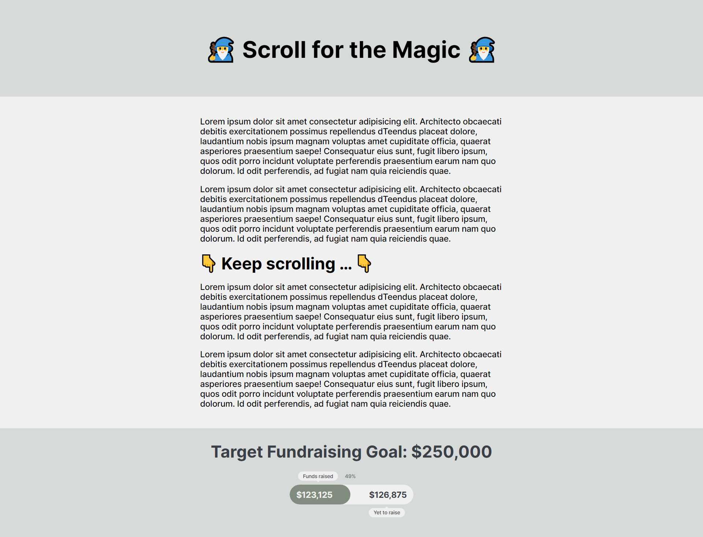

# Custom Progress Bar Animation (HTML, CSS, and Vanilla JavaScript)

Progress bars are great for communicating information, but poor at looking good 😎. Let’s create our own custom progress animation! In this video, we’ll walk through a custom progress bar that’s fully accessible. Along the way we’ll…
- Use custom CSS counters
- Animate a CSS variable with the @property
- Delay animations and fades until they’re in the viewport with the JS intersection observer
- and more!

🔗  Key Links 🔗
- CodePen: https://codepen.io/Coding-in-Public/full/RwQGJRj

---------------------------------------

🔗  Additional Links 🔗
- Open Props CSS: https://open-props.style/
- Inter Google Font: https://fonts.google.com/specimen/Inter
- Andy Bell’s CSS reset: https://piccalil.li/blog/a-modern-css-reset/

---------------------------------------

📹  Related Videos 📹
- OpenProps: https://www.youtube.com/watch?v=cq7c3tawEnI&t=0s
- Intersection Observer: https://www.youtube.com/watch?v=m8WLd37Y9Ew&t=0s